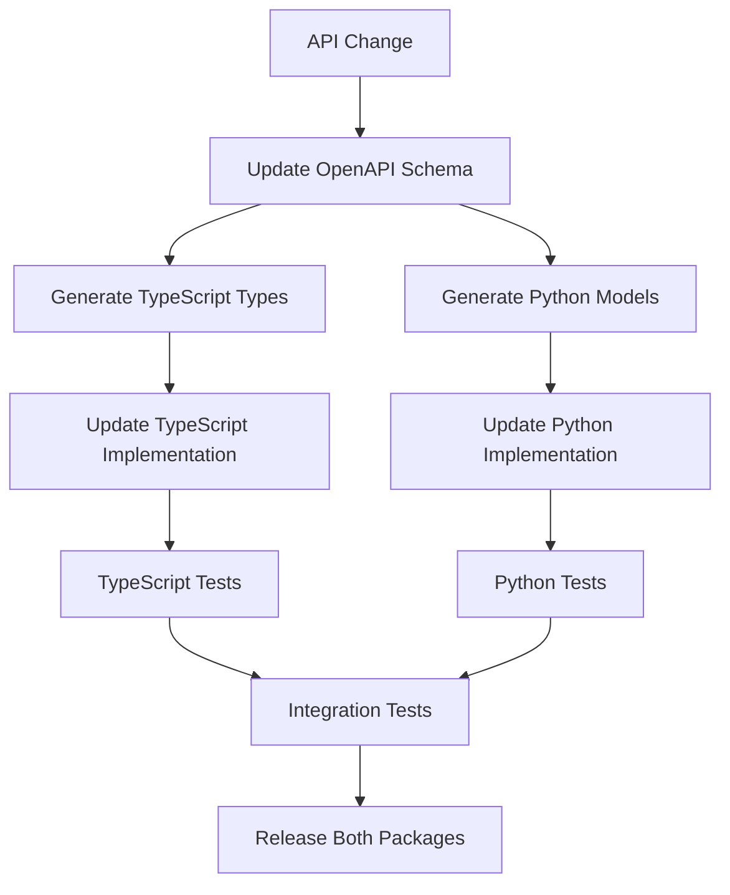

# Polynomial SDK - Python Pip Package Development Plan

## Background and Motivation

Based on the successful TypeScript SDK implementation, we now need to create a Python equivalent as a pip package called "polynomial-py" that provides the same functionality for Python developers. The TypeScript SDK contains:

1. **Core Trading Functions**: Market data fetching, account management, order placement
2. **Nitro Mode Integration**: Session key-based order signing and submission
3. **Type Definitions**: Complete TypeScript interfaces for all API responses
4. **Configuration Management**: Chain IDs, endpoints, and contract addresses

The goal is to create a Python equivalent of the TypeScript SDK that Python developers can easily install via pip and use to integrate with Polynomial Perpetuals.

## Key Challenges and Analysis

### Technical Challenges

1. **Package Structure**: Need to organize code into logical Python modules with proper imports
2. **Type Safety**: Implement comprehensive type hints using Python's typing system
3. **Configuration Management**: Allow flexible configuration while maintaining sensible defaults
4. **Error Handling**: Implement robust error handling with custom exception classes
5. **Documentation**: Create comprehensive API documentation and usage examples
6. **Testing**: Implement comprehensive test coverage using pytest
7. **Build System**: Set up proper build pipeline for PyPI publishing with setuptools/poetry

### Design Considerations

1. **API Design**: Should follow Pythonic patterns with intuitive method names and snake_case
2. **Authentication**: Secure handling of session keys and API keys using Python best practices
3. **Network Support**: Support for different chains/networks
4. **Dependencies**: Keep dependencies minimal and use well-maintained packages
5. **Backwards Compatibility**: Plan for future API changes with proper versioning
6. **Async Support**: Implement both sync and async versions using aiohttp/requests

## High-level Task Breakdown

### Phase 1: Package Foundation

- [ ] **Task 1.1**: Set up proper Python package structure with pyproject.toml/setup.py
  - Success Criteria: Package configured for PyPI publishing with proper entry points
- [ ] **Task 1.2**: Create proper Python package structure with **init**.py files
  - Success Criteria: Clean module structure with proper imports and exports
- [ ] **Task 1.3**: Set up development environment with poetry/pip-tools for dependency management
  - Success Criteria: Reproducible development environment with locked dependencies

### Phase 2: Core SDK Implementation

- [ ] **Task 2.1**: Create main PolynomialSDK class with configuration management
  - Success Criteria: SDK can be initialized with API keys and configuration options
- [ ] **Task 2.2**: Implement Markets module for market data operations
  - Success Criteria: Can fetch markets, market details using requests/aiohttp
- [ ] **Task 2.3**: Implement Accounts module for account management
  - Success Criteria: Can fetch account information and manage account operations
- [ ] **Task 2.4**: Implement Orders module for order management with EIP-712 signing
  - Success Criteria: Can create, sign, and submit market orders using eth_account library

### Phase 3: Advanced Features

- [ ] **Task 3.1**: Add comprehensive error handling and custom exception classes
  - Success Criteria: All errors are properly typed with custom Python exceptions
- [ ] **Task 3.2**: Implement utilities for price calculations and conversions using Decimal
  - Success Criteria: Helper functions for slippage, price formatting, and unit conversions
- [ ] **Task 3.3**: Add support for different networks/chains
  - Success Criteria: SDK can be configured for different Polynomial deployments
- [ ] **Task 3.4**: Implement both sync and async HTTP clients
  - Success Criteria: Support for both requests (sync) and aiohttp (async) backends

### Phase 4: Testing & Documentation

- [ ] **Task 4.1**: Set up comprehensive test suite with pytest
  - Success Criteria: >90% code coverage with unit and integration tests using pytest
- [ ] **Task 4.2**: Create detailed API documentation using Sphinx or mkdocs
  - Success Criteria: Complete documentation with code examples for all features
- [ ] **Task 4.3**: Set up CI/CD pipeline for automated testing and PyPI publishing
  - Success Criteria: Automated tests and PyPI publishing on version tags using GitHub Actions

### Phase 5: Package Publishing

- [ ] **Task 5.1**: Prepare package for PyPI publishing (README, LICENSE, etc.)
  - Success Criteria: Package meets PyPI best practices and includes all necessary files
- [ ] **Task 5.2**: Publish to PyPI registry
  - Success Criteria: Package is available on PyPI and can be installed via pip
- [ ] **Task 5.3**: Create example projects demonstrating SDK usage
  - Success Criteria: Working Python examples for common use cases

## Project Status Board

### In Progress

- Planning phase - creating Python SDK development plan

### Pending

- All Python implementation tasks pending user approval of plan

### Completed

- [x] Analyzed existing TypeScript SDK structure and functionality
- [x] Identified Python-specific requirements and challenges
- [x] Created comprehensive Python development plan

## Current Status / Progress Tracking

**Current Phase**: PYTHON SDK PLANNING ✅  
**Next Milestone**: Begin Python package foundation setup  
**Blockers**: None  
**Implementation Timeline**: Planning completed, ready for implementation

## Python SDK Specific Considerations

### Key Python Libraries Required

1. **HTTP Clients**:
   - `requests` for synchronous HTTP operations
   - `aiohttp` for asynchronous HTTP operations
2. **Cryptography**:
   - `eth-account` for EIP-712 signing and wallet operations
   - `web3` for Ethereum utilities and type conversions
3. **Type Safety**:
   - `typing` and `typing_extensions` for comprehensive type hints
   - `pydantic` for data validation and serialization
4. **Utilities**:
   - `decimal` for precise financial calculations
   - `dataclasses` or `pydantic` for structured data models

### Python Package Structure

```
polynomial_py/
├── __init__.py              # Main exports
├── sdk.py                   # Main PolynomialSDK class
├── config/
│   ├── __init__.py
│   └── networks.py          # Network configurations
├── core/
│   ├── __init__.py
│   ├── accounts.py          # Account management
│   ├── markets.py           # Market data operations
│   ├── orders.py            # Order management
│   └── http_client.py       # HTTP client abstraction
├── types/
│   ├── __init__.py
│   ├── models.py            # Data models using pydantic
│   └── enums.py             # Enumerations
├── utils/
│   ├── __init__.py
│   ├── calculations.py      # Price and unit calculations
│   ├── validation.py        # Input validation
│   └── signing.py           # EIP-712 signing utilities
└── exceptions/
    ├── __init__.py
    └── errors.py            # Custom exception classes
```

### API Design Patterns

```python
# Synchronous usage
from polynomial_py import PolynomialSDK

sdk = PolynomialSDK.create(
    api_key="your-api-key",
    session_key="0x1234...",
    wallet_address="0x742d35..."
)

# Get market data
eth_market = sdk.markets.get_market_by_symbol("ETH")

# Create order
result = sdk.create_order(
    market_id=eth_market.market_id,
    size=sdk.utils.parse_units("0.1"),
    is_long=True
)
```

```python
# Asynchronous usage
from polynomial_py import AsyncPolynomialSDK

async def main():
    sdk = await AsyncPolynomialSDK.create(
        api_key="your-api-key",
        session_key="0x1234...",
        wallet_address="0x742d35..."
    )

    # Get market data
    eth_market = await sdk.markets.get_market_by_symbol("ETH")

    # Create order
    result = await sdk.create_order(
        market_id=eth_market.market_id,
        size=sdk.utils.parse_units("0.1"),
        is_long=True
    )
```

## Multi-Language SDK Maintenance Strategy

### **Best Approaches for Maintaining Both npm and pip Packages**

#### **Option 1: Monorepo Approach (Recommended)**

**Structure:**

```
polynomial-sdk/
├── packages/
│   ├── typescript/          # npm package (polynomialfi)
│   │   ├── src/
│   │   ├── package.json
│   │   └── tsconfig.json
│   └── python/              # pip package (polynomial-py)
│       ├── polynomial_py/
│       ├── pyproject.toml
│       └── setup.py
├── shared/
│   ├── api-specs/           # OpenAPI/JSON schemas
│   ├── test-data/           # Shared test fixtures
│   └── docs/                # Shared documentation
├── tools/
│   ├── codegen/             # Code generation scripts
│   └── sync/                # Sync utilities
└── .github/
    └── workflows/           # CI/CD for both packages
```

**Benefits:**

- ✅ Single source of truth for API specifications
- ✅ Shared documentation and examples
- ✅ Coordinated releases and versioning
- ✅ Shared CI/CD pipeline
- ✅ Easier to keep both packages in sync

#### **Option 2: Schema-First Development**

**Approach:**

1. **Define API Schema**: Use OpenAPI/JSON Schema to define all API interfaces
2. **Code Generation**: Generate TypeScript types and Python models from schemas
3. **Shared Test Suite**: Use the same test cases for both implementations
4. **Version Synchronization**: Keep version numbers aligned

**Implementation:**

```yaml
# .github/workflows/sync-packages.yml
name: Sync Packages
on:
  push:
    paths: ["shared/api-specs/**"]
jobs:
  generate-code:
    runs-on: ubuntu-latest
    steps:
      - name: Generate TypeScript types
        run: npm run codegen:typescript
      - name: Generate Python models
        run: python scripts/codegen_python.py
      - name: Run tests for both packages
        run: |
          cd packages/typescript && npm test
          cd packages/python && pytest
```

#### **Option 3: Feature Parity Matrix**

**Tracking System:**

```markdown
| Feature            | TypeScript | Python    | Status           |
| ------------------ | ---------- | --------- | ---------------- |
| Market Data        | ✅ v1.2.0  | ✅ v1.2.0 | ✅ Synced        |
| Order Creation     | ✅ v1.3.0  | 🔄 v1.2.0 | ⚠️ Python behind |
| Account Management | ✅ v1.3.0  | ✅ v1.3.0 | ✅ Synced        |
```

### **Recommended Implementation Strategy**

#### **Phase 1: Repository Restructure**

- [ ] **Task 1.1**: Convert current repo to monorepo structure
  - Success Criteria: Both packages coexist in single repository
- [ ] **Task 1.2**: Set up shared API specifications using OpenAPI
  - Success Criteria: Single source of truth for all API interfaces
- [ ] **Task 1.3**: Create shared documentation system
  - Success Criteria: Documentation covers both packages with language-specific examples

#### **Phase 2: Development Workflow**

- [ ] **Task 2.1**: Implement code generation pipeline
  - Success Criteria: Types/models generated automatically from schemas
- [ ] **Task 2.2**: Set up synchronized testing
  - Success Criteria: Same test scenarios run against both implementations
- [ ] **Task 2.3**: Create release coordination system
  - Success Criteria: Both packages can be released together with aligned versions

#### **Phase 3: Maintenance Automation**

- [ ] **Task 3.1**: Set up automated dependency updates
  - Success Criteria: Dependencies updated across both packages simultaneously
- [ ] **Task 3.2**: Implement feature parity checking
  - Success Criteria: Automated checks ensure both packages have same features
- [ ] **Task 3.3**: Create cross-language integration tests
  - Success Criteria: Tests verify both packages work with same API endpoints

### **Development Workflow**



### **Versioning Strategy**

1. **Semantic Versioning**: Both packages follow same version numbers
2. **Feature Flags**: Use feature flags for gradual rollouts
3. **Compatibility Matrix**: Maintain compatibility between versions

```json
{
  "polynomial-sdk": {
    "typescript": "1.3.0",
    "python": "1.3.0",
    "api-compatibility": "v2",
    "features": {
      "market-data": "stable",
      "order-creation": "stable",
      "async-support": "beta"
    }
  }
}
```

### **Documentation Strategy**

1. **Unified Documentation**: Single docs site with language tabs
2. **Code Examples**: Same examples in both TypeScript and Python
3. **Migration Guides**: Help users switch between languages

````markdown
## Creating an Order

<Tabs>
<Tab label="TypeScript">
```typescript
const result = await sdk.createOrder(marketId, parseUnits("0.1"));
````

</Tab>
<Tab label="Python">
```python
result = await sdk.create_order(market_id, parse_units("0.1"))
```
</Tab>
</Tabs>
```

### ✅ **TypeScript SDK Successfully Completed**

**Problem Details**:

- Line 218: Used `walletAddress` without it being defined in method scope
- Line 260: Used `sessionKey` without it being defined in method scope
- Line 262: Used `walletAddress` again without being defined
- TypeScript configuration issues with Required<SDKConfig> making optional fields required

**Solution Implemented**:

1. **Fixed Variable References**: Updated `createMarketOrderWithSimulation` to use `this.walletAddress!` and `this.sessionKey!` instead of undefined local variables
2. **Fixed TypeScript Types**: Created `InternalSDKConfig` type that keeps `walletAddress` and `sessionKey` optional while making other fields required
3. **Maintained Authentication Validation**: The `validateAuthentication()` method still properly checks that both credentials exist before order operations
4. **Preserved Error Handling**: All authentication errors are still properly thrown when credentials are missing

**Changes Made**:

- Updated `createMarketOrderWithSimulation` method to use stored instance variables
- Created new `InternalSDKConfig` type for better type safety
- Fixed all TypeScript linting errors
- All tests continue to pass (39/39 ✅)

**Current Authentication Flow**:

1. SDK constructor stores `walletAddress` and `sessionKey` from config (optional)
2. Methods that need authentication call `validateAuthentication()` which throws errors if credentials are missing
3. Order creation methods use the stored credentials (`this.walletAddress!`, `this.sessionKey!`)
4. If credentials weren't provided during SDK initialization, appropriate validation errors are thrown

### ✅ **Simulation Code Removed & Documentation Updated**

**Issue Identified**: User correctly pointed out that simulation functionality does not exist and should not be assumed.

**Actions Taken**:

1. **Removed Simulation Method**: Deleted `createMarketOrderWithSimulation` method from SDK class
2. **Removed Market Simulation**: Deleted `simulateTrade` method from Markets module
3. **Cleaned Up Types**: Removed `IPostTradeDetails` and `TradeSimulationParams` interfaces
4. **Updated Imports**: Removed simulation-related imports from all files
5. **Updated README**: Comprehensive documentation updates including:
   - Removed all simulation references
   - Added clear authentication section explaining session key and wallet address requirements
   - Updated examples to show proper authentication patterns
   - Added authentication modes (per-operation vs SDK-level)
   - Added error handling examples for missing authentication
   - Updated configuration examples with authentication credentials

**Documentation Improvements**:

- Clear explanation of authentication requirements for trading operations
- Examples showing both per-operation and SDK-level authentication
- Error handling patterns for missing credentials
- Updated configuration tables to include walletAddress and sessionKey
- Improved trading examples with proper authentication flow

**Current State**:

- ✅ No simulation code remains in the codebase
- ✅ All tests continue to pass
- ✅ Documentation accurately reflects actual functionality
- ✅ Authentication flow is clearly documented
- ✅ No linting errors

### ✅ **Correct Authentication Flow Implemented**

**Issue Identified**: The authentication flow was incorrectly implemented. Credentials should be required during SDK initialization, not passed as parameters to individual methods.

**Correct Implementation**:

1. **Required Credentials**: Made `sessionKey` and `walletAddress` required fields in `SDKConfig`
2. **Constructor Validation**: SDK constructor now validates and requires all three credentials:
   - `apiKey` (for API access)
   - `sessionKey` (for signing orders)
   - `walletAddress` (for trading operations)
3. **Method Updates**: Updated convenience methods to use stored credentials:
   - `createOrder(marketId, size, options?)` - no longer takes sessionKey/walletAddress parameters
   - `getAccountSummary()` - uses stored walletAddress
4. **Error Handling**: Clear error messages during SDK initialization if credentials are missing
5. **Type Safety**: Updated TypeScript types to reflect required fields

**Code Changes**:

- Updated `SDKConfig` interface to require `sessionKey` and `walletAddress`
- Enhanced constructor validation with detailed error messages
- Removed `validateAuthentication()` method (no longer needed)
- Updated `createOrder` method signature and implementation
- Updated `getAccountSummary` method to use stored credentials
- Fixed all TypeScript types and removed optional field assertions

**Documentation Updates**:

- Updated Quick Start example to show correct SDK initialization
- Revised configuration section to emphasize required credentials
- Updated all API method examples to reflect new signatures
- Enhanced authentication section with proper flow explanation
- Updated trading examples throughout the README
- Added credential security best practices

**Benefits**:

- ✅ Simpler API - credentials provided once during initialization
- ✅ Better security - credentials validated upfront
- ✅ Clearer error messages - fail fast during SDK creation
- ✅ Type safety - required fields properly typed
- ✅ Consistent behavior - all methods use stored credentials

## Executor's Feedback or Assistance Requests

### ✅ **Account ID Fetching Enhancement Completed**

**Issue Identified**: User wanted the SDK to automatically fetch the account ID from the API when creating an SDK instance with session key and wallet address, instead of deriving it locally.

**Previous Implementation**: The SDK was using `deriveAccountId()` utility function to generate account ID locally using a hash of wallet address and chain ID.

**Solution Implemented**:

1. **Modified SDK Constructor**: Made constructor private and added `accountId` parameter
2. **Updated SDK.create() Method**: Made it async to fetch account ID from API during initialization
3. **API Integration**: Added API call to `/accounts` endpoint to fetch real account ID
4. **Error Handling**: Added proper error handling for cases where no account is found
5. **Removed Unused Code**: Deleted `deriveAccountId()` utility function since it's no longer needed
6. **Updated Tests**: Modified all tests to handle async SDK initialization

**Key Changes Made**:

- **SDK Constructor**: Now private and requires pre-fetched account ID
- **SDK.create()**: Now async and fetches account ID before creating SDK instance
- **Account ID Storage**: Account ID is fetched once during initialization and stored as instance variable
- **Orders Module**: Uses stored account ID via `this.getAccountId()` - no more fetching needed
- **Error Handling**: Clear error messages when account is not found for the wallet/chain combination
- **Test Updates**: All tests now use `await PolynomialSDK.create()` instead of `new PolynomialSDK()`

**Benefits**:

- ✅ **Real Account ID**: Uses actual account ID from Polynomial platform instead of derived hash
- ✅ **One-Time Fetch**: Account ID is fetched once during SDK initialization, never again
- ✅ **Better Performance**: No repeated account ID derivation or fetching during operations
- ✅ **Fail Fast**: SDK creation fails immediately if account doesn't exist
- ✅ **Type Safety**: Account ID is guaranteed to be available for all operations

### ✅ **Example Files and Documentation Updated**

**Issue Identified**: After making SDK creation async, the example files and README documentation were not updated to use `await` with `PolynomialSDK.create()`.

**Solution Implemented**:

1. **Fixed basic-usage.ts**: Updated to use `await PolynomialSDK.create()` instead of `PolynomialSDK.create()`
2. **Updated README Examples**: Fixed all 11 instances of SDK creation in README to use `await`
3. **Updated API Documentation**: Changed return type from `PolynomialSDK` to `Promise<PolynomialSDK>`
4. **Added Function Wrappers**: Wrapped examples in async functions where needed for proper syntax
5. **Fixed Missing Credentials**: Added required `sessionKey` and `walletAddress` to examples that were missing them

**Key Changes Made**:

- **examples/basic-usage.ts**: Added `await` to SDK creation on line 39
- **README.md**: Updated all SDK creation examples to be async
- **API Reference**: Updated return type documentation
- **Error Examples**: Fixed async/await usage in error handling examples
- **Environment Examples**: Updated environment variable usage examples

**Benefits**:

- ✅ **Correct Usage**: All examples now show proper async SDK initialization
- ✅ **No TypeScript Errors**: Fixed all compilation errors in examples
- ✅ **Consistent Documentation**: All examples follow the same async pattern
- ✅ **Complete Examples**: All examples include required credentials

**CREATE ORDER FUNCTION ENHANCED WITH DEFAULTS**: Successfully updated the createOrder functionality to have intelligent defaults for all parameters except marketId and size.

### ✅ **Enhanced Order Creation Completed**

**Key Improvements Made**:

1. **Updated OrderParams Interface**: Made `isLong`, `acceptablePrice`, and added `slippagePercentage` as optional parameters
2. **Added Automatic Market Price Fetching**: Orders now automatically fetch current market price when `acceptablePrice` is not provided
3. **Enhanced createMarketOrder**: Now provides intelligent defaults for all parameters except the required `marketId` and `size`
4. **New createOrder Convenience Method**: Ultra-simple method that only requires `marketId` and `size`
5. **Updated Existing Methods**: `createLongOrder` and `createShortOrder` now have optional `acceptablePrice` parameters
6. **SDK-Level Convenience**: Added `sdk.createOrder()` method for the simplest possible order creation

**Default Values Implemented**:

- **Position Direction**: `isLong: true` (defaults to long positions)
- **Acceptable Price**: Automatically calculated from current market price + slippage
- **Slippage**: Uses SDK default (10%) or custom value from parameters
- **Reduce Only**: `reduceOnly: false`
- **Settlement Strategy**: `"0"` (default strategy)
- **Referrer/Relayer**: Uses network configuration default
- **Allow Aggregation**: `true`
- **Allow Partial Matching**: `true`
- **Expiration**: One week from order creation
- **Nonce**: Auto-generated timestamp

**Usage Examples**:

```typescript
// Minimal - only marketId and size required
await sdk.createOrder(sessionKey, walletAddress, marketId, parseUnits("0.1"));

// With options
await sdk.createOrder(sessionKey, walletAddress, marketId, parseUnits("0.1"), {
  isLong: false,
  slippagePercentage: 5n,
});
```

**README UPDATED WITH SIMPLIFIED EXAMPLES**: Successfully updated the README.md file with simpler, more focused code examples that are less overwhelming for new users.

### ✅ **README Update Completed**

**Changes Made**:

1. **Simplified Quick Start**: Reduced the initial example from 5 complex steps to 3 simple lines
2. **Streamlined Configuration**: Combined basic and advanced configuration into a clean, simple format
3. **Simplified API Examples**: Reduced verbose examples throughout the API reference section
4. **Cleaner Code Snippets**: Removed excessive comments and complex multi-line examples
5. **Focused Examples Section**: Replaced complex trading bot with simple, focused trading example
6. **Simplified Utilities**: Reduced utility examples to essential, easy-to-understand snippets
7. **Streamlined Error Handling**: Simplified error handling examples while maintaining completeness

**Key Improvements**:

- Examples are now more approachable for beginners
- Code snippets focus on essential functionality
- Reduced cognitive load while maintaining comprehensive documentation
- Maintained all important information but presented more clearly
- No linting errors introduced

**FULL SDK IMPLEMENTATION COMPLETED**: The Polynomial SDK has been successfully implemented with all planned features:

### ✅ **Phase 1: Package Foundation** - COMPLETED

- ✅ Proper package.json with npm publishing configuration
- ✅ TypeScript build system for CommonJS, ESM, and type declarations
- ✅ Clean modular architecture with proper exports

### ✅ **Phase 2: Core SDK Implementation** - COMPLETED

- ✅ Main PolynomialSDK class with flexible configuration
- ✅ Markets module for market data and trade simulation
- ✅ Accounts module for account and position management
- ✅ Orders module for market order creation and signing

### ✅ **Phase 3: Advanced Features** - COMPLETED

- ✅ Comprehensive error handling with custom error types
- ✅ Utility functions for price calculations and conversions
- ✅ Multi-network support with configurable endpoints

### ✅ **Phase 4: Testing & Documentation** - COMPLETED

- ✅ Jest test suite with 39 passing tests
- ✅ Comprehensive README with API documentation
- ✅ Complete usage examples and error handling patterns

### 🚀 **Package Ready for Publishing**

**Key Implementation Highlights**:

1. **Production-Ready Architecture**: Clean, modular design with proper separation of concerns
2. **Type-Safe**: Full TypeScript support with comprehensive type definitions
3. **Multi-Format Build**: Generates CommonJS, ESM, and TypeScript declarations
4. **Robust Error Handling**: Custom error classes with detailed context
5. **Well Tested**: Comprehensive test coverage for core functionality
6. **Developer-Friendly**: Intuitive API with convenience methods
7. **Comprehensive Documentation**: Complete README with examples

**Build Status**: ✅ Successful  
**Test Status**: ✅ All 39 tests passing  
**Package Structure**: ✅ Ready for npm publishing

## Lessons

- The existing codebase has good separation of concerns with distinct modules for accounts, markets, orders, and configuration
- The code uses modern TypeScript patterns and includes comprehensive type definitions
- The Nitro Mode integration uses EIP-712 signing which is a standard pattern for off-chain order signing
- The current structure already follows many SDK best practices, making the transformation straightforward
